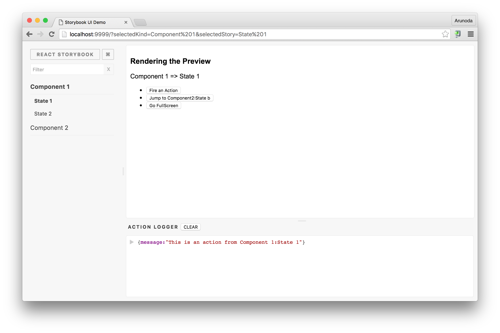
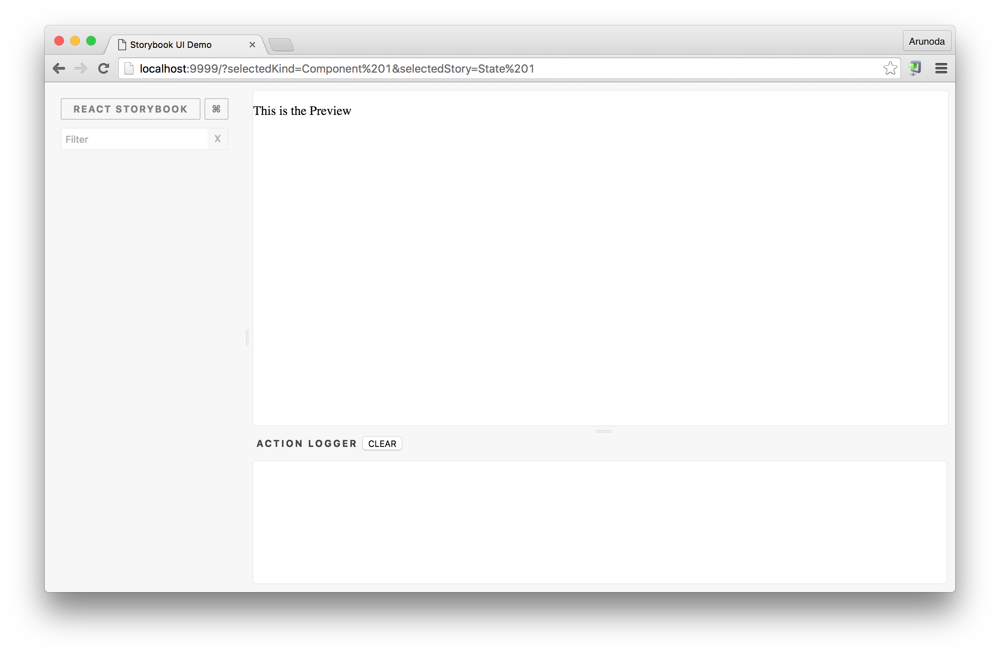

# Storybook UI

This is the core UI of [react-storybook](https://github.com/kadirahq/react-storybook) and other similar projects. It's a React based UI where you can initialize with a simple function. You can configure it by providing a simple provider API.



## Usage

First you need to install `@kadira/storybook-ui` into your app.

```sh
npm i --save @kadira/storybook-ui
```

Then you need to create a Provider class like this:

```js
// provider.js
import { Provider } from '@kadira/storybook-ui';
import React from 'react';

export default class MyProvider extends Provider {
  renderPreview() {
    return (
      <p>This is the Preview</p>
    );
  }

  handleAPI(api) {
    // no need to do anything for now.
  }
}
```

Then you need to initialize the UI like this:

```js
import Provider from './provider';
import renderStorybookUI from '@kadira/storybook-ui';

const roolEl = document.getElementById('root');
renderStorybookUI(roolEl, new Provider());
```

Then you'll get a UI like this:



> **See the [example](/example) app for a complete example.**

## Hacking Guide

If you like to add features to the Storybook UI or fix bugs, this is the guide you need to follow.

First of all, you can need to start the [example](/example) app to see your changes.

### The App

This is a Redux app written based on the [Mantra architecture](https://github.com/kadirahq/mantra/).
It's a set of modules. You can see those modules at `src/modules` directory.

### Changing UI

If you like to change the appearance of the UI, you need to look at the `ui` module. Simply change components at the `components` directory for simple UI tweaks.

You can also change containers(which are written with [react-komposer](https://github.com/kadirahq/react-komposer/)) to add more data from the redux state.

### Redux

Each module has a it's own set of reducers at `<module>/configs/reducers` directory. These reducers are loaded in the `src/index.js`(inside the main api).

### Mounting

The UI is mounted in the `src/modules/ui/routes.js`. Inside that, we have injected dependencies as well. Refer [mantra-core](https://github.com/mantrajs/mantra-core) for that.

We've injected the context and actions.

### App Context

App context is the app which application context you initialize when creating the UI. It is initialized in the `src/index.js` file. It's a non serializable state. You can access the app context from containers and basically most of the place in the app.

So, that's the place to put app wide configurations and objects which won't changed after initialized. Our redux store is also stayed inside the app context.

### Actions

Actions are the place we implement app logic in a Mantra app. Each module has a set of actions and they are globally accessible. These actions are located at `<module>/actions` directory.

They got injected into the app(when mounting) and you can access them via containers. If you are familiar with redux, this is exactly action creators. But they are not only limited to do redux stuff. Actions has the access to the app context, so literally it can do anything.

### Core API

Core API (which is passed to the Provider with `handleAPI` method) is implemented in the `api` module. We put the provider passed by the user in the app context. Then api module access it and use it as needed.

### Keyboard Shortcuts

Keyboard shortcuts are implemented in a bit different way. The final state of keyboard shortcuts is managed by the `shortcuts` module. But they are implemented in the `ui` module with `src/modules/ui/configs/handle_routing.js`

These shortcuts also can be called from main API using the `handleShortcut` method. Check the example app for the usage. That's implemented as an action in the `shortcuts` module.

The above action(or the `handleShortcut` method) accepts events as a constant defined by this module. They are defined in the `src/libs/key_events.js`. This is basically to serialize these events.

> In react-storybook we need to pass these events from the preview iframe to the main app. That's the core reason for this.

### URL Changes

We are not using any routing library. That's because, we don't want to do routing, but wanted to add some query params and use them.

Routing logic is implemented in the `src/modules/ui/configs/handle_routing.js` configuration.
