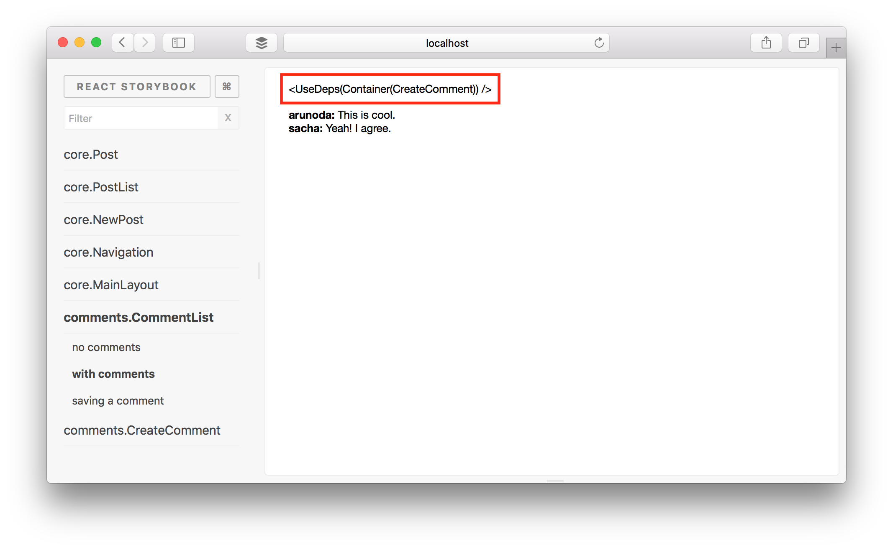
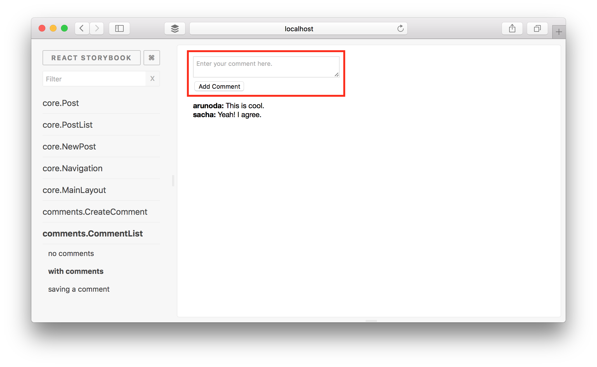

# react-komposer

Let's compose React containers and feed data into components. <br>
(supports ReactNative as well)

## TOC

* [Why](#why)
* [Installation](#installation)
* [Basic Usage](#basic-usage)
* [API](#api)
* [Using with XXX](#using-with-xxx)
    - [Using with Promises](#using-with-promises)
    - [Using with Meteor](#using-with-meteor)
    - [Using with Rx.js Observables](#using-with-rxjs-observables)
    - [Using with Redux](#using-with-redux)
* [Extending](#extending)
* [Stubbing](#stubbing)
* [Caveats](#caveats)

## Why?

Lately, in React we try to avoid the use of component state as much as possible and use props to handle the passing of data and actions.
We call these stateless components **Dumb Components** or **UI Components.**

There is another component layer on-top of these **Dumb Components** which handles the **data fetching** logic. We call these components **Containers**. Containers usually do things like:

* Request for data (invoke a subscription or just fetch it).
* Show a loading screen while the data is fetching.
* Once data arrives, pass it to the UI Component.
* If there is an error, show it to the user.
* It may need to re-fetch or re-subscribe when props change.
* It needs to cleanup resources (like subscriptions) when the container is unmounting.

If you want to do these yourself, you have to do a lot of **repetitive tasks**. This commonly leads to **human errors**.

**Meet React Komposer**

That's what we are going to fix with this project. You simply tell it how to get data and clean up resources, then it'll
do the hard work for you. This is a universal project and works with **any kind of data source**, whether it's based on
Promises, Rx.JS observables, a Redux store or even Meteor's Tracker.

## Installation

```
npm i --save react-komposer
```

## Basic Usage

Let's say we need to build a clock. First let's create a UI Component to show the time.

```js
const Time = ({time}) => (<div>Time is: {time}</div>);
```

Now let's define how to fetch data for this:

```js
const onPropsChange = (props, onData) => {
  const handle = setInterval(() => {
    const time = (new Date()).toString();
    onData(null, {time});
  }, 1000);

  const cleanup = () => clearInterval(handle);
  return cleanup;
};
```

In the above function, we get new data every second and send it via the `onData` callback. Additionally, we return a cleanup function from the function to cleanup its resources.

Okay. Now it's time to create the clock Container, wrapped around our Time UI Component, using our `onPropsChange` function:

```js
import { compose } from 'react-komposer';
const Clock = compose(onPropsChange)(Time);
```

That's it. Now render the clock to the DOM.

```js
import ReactDOM from 'react-dom';
ReactDOM.render(<Clock />, document.body);
```

See this live: <https://jsfiddle.net/arunoda/jxse2yw8>

### Additional Benefits

Other than the main benefits, now it's super easy to test our UI code. We can easily do it via a set of unit tests.

* For the UI Components, simply test the plain React component. In this case, `Time` (you can use [enzyme](https://github.com/airbnb/enzyme)).
* Then test `onPropsChange` for different scenarios.

## API

You can customize the higher order component created by `compose` in few ways. Let's discuss.

### Handling Errors

Rather than showing the data, sometimes you need to deal with errors. Here's how to use `compose` for that:

```js
const onPropsChange = (props, onData) => {
  // oops some error.
  onData(new Error('Oops'));
};
```

The error will be rendered to the screen (in place of where the component is rendered).
You must provide a [JavaScript Error object](https://developer.mozilla.org/en/docs/Web/JavaScript/Reference/Global_Objects/Error).

You can clear it by passing some data again like this:

```js
const onPropsChange = (props, onData) => {
  // oops some error.
  onData(new Error('Oops'));

  setTimeout(() => {
    onData(null, {time: Date.now()});
  }, 5000);
};
```

### Detect props changes

Sometimes you can use the props to customize our data fetching logic. Here's how to do it:

```js
const onPropsChange = (props, onData) => {
  const handle = setInterval(() => {
    const time = (props.timestamp)? Date.now() : (new Date()).toString();
    onData(null, {time});
  }, 1000);

  const cleanup = () => clearInterval(handle);
  return cleanup;
};
```

Here we are asking to make the Clock to display timestamp instead of the Date string. See:

```js
ReactDOM.render((
  <div>
    <Clock timestamp={true}/>
    <Clock />
  </div>
), document.body);
```

See this live: <https://jsfiddle.net/arunoda/7qy1mxc7/>

### Change the Loading Component

```js
const MyLoading = () => (<div>Hmm...</div>);
const Clock = compose(onPropsChange, MyLoading)(Time);
```

> This custom loading component receives all the props passed to the UI Component as well.
> So, based on those props, you can change the behaviour of the loading component also.

### Change the Error Component

```js
const MyError = ({error}) => (<div>Error: {error.message}</div>);
const Clock = compose(onPropsChange, null, MyError)(Time);
```

### Compose Multiple Containers

Sometimes we need to compose multiple containers at once, in order to use different data sources. Checkout the following examples:

```js
const Clock = composeWithObservable(composerFn1)(Time);
const MeteorClock = composeWithTracker(composerFn2)(Clock);

export default MeteorClock;
```

For the above case, we've a utility called `composeAll` to make our life easier. To use it:

```js
export default composeAll(
  composeWithObservable(composerFn1),
  composeWithTracker(composerFn2)
)(Time)
```

### Pure Containers

`react-komposer` checks the purity of payload, error and props, avoiding unnecessary render function calls. That means
we've implemented the `shouldComponentUpdate` lifecycle method, which follows something similar to React's [shallowCompare](https://facebook.github.io/react/docs/shallow-compare.html).

If you need to turn off this functionality, you can do it like this:

```js
// You can use `composeWithPromise` or any other compose APIs
// instead of `compose`.
const Clock = compose(onPropsChange, null, null, {pure: false})(Time);
```

### Ref to base component

In some situations, you need to get a ref to the base component that you pass to `react-komposer`. You can enable a `ref` with the `withRef` option:

```js
// You can use `composeWithPromise` or any other compose APIs
// instead of `compose`.
const Clock = compose(onPropsChange, null, null, {withRef: true})(Time);
```

The base component will then be accessible with `getWrappedInstance()`. <br/>
Checkout this [test case](https://github.com/kadirahq/react-komposer/blob/master/lib/__tests__/compose.js#L90) for a proper example.

### Change Default Components

It is possible to change default error and loading components globally, so you don't need to set default components in every composer call.

Here's how do it:

```js
import {
  setDefaultErrorComponent,
  setDefaultLoadingComponent,
} from 'react-komposer';

const ErrorComponent = () => (<div>My Error</div>);
const LoadingComponent = () => (<div>My Loading</div>);

setDefaultErrorComponent(ErrorComponent);
setDefaultLoadingComponent(LoadingComponent);
```

> This is very important if you are using this in a React Native app,
> as this project has no default components for React Native.
> So you can set default components, as shown above, at the very beginning.

## Using with XXX

### Using with Promises

For use with Promise-based data sources, you can use `composeWithPromise` instead of `compose`.

```js
import {composeWithPromise} from 'react-komposer'

// Create a component to display Time
const Time = ({time}) => (<div>{time}</div>);

// Assume this get's the time from the Server
const getServerTime = () => {
  return new Promise((resolve) => {
    const time = new Date().toString();
    setTimeout(() => resolve({time}), 2000);
  });
};

// Create the composer function and tell how to fetch data
const composerFunction = (props) => {
  return getServerTime();
};

// Compose the container
const Clock = composeWithPromise(composerFunction)(Time, Loading);

// Render the container
ReactDOM.render(<Clock />, document.getElementById('react-root'));
```

See this live: <https://jsfiddle.net/arunoda/8wgeLexy/>

### Using with Meteor

For use with Meteor, you need to use `composeWithTracker` instead of `compose`, from where you can watch any Reactive data.

```js
import {composeWithTracker} from 'react-komposer';
import PostList from '../components/post_list.jsx';

function composer(props, onData) {
  if (Meteor.subscribe('posts').ready()) {
    const posts = Posts.find({}, {sort: {_id: 1}}).fetch();
    onData(null, {posts});
  };
};

export default composeWithTracker(composer)(PostList);
```

In addition to above, you can also return a cleanup function from the composer function. See the following example:

```js
import {composeWithTracker} from 'react-komposer';
import PostList from '../components/post_list.jsx';

const composerFunction = (props, onData) => {
  // tracker related code
  return () => {console.log('Container disposed!');}
};

// Note the use of composeWithTracker
const Container = composeWithTracker(composerFunction)(PostList);
```

For more information, refer this article: [Using Meteor Data and React with Meteor 1.3](https://voice.kadira.io/using-meteor-data-and-react-with-meteor-1-3-13cb0935dedb)


### Using with Rx.js Observables

```js
import {composeWithObservable} from 'react-komposer'

// Create a component to display Time
const Time = ({time}) => (<div>{time}</div>);

const now = Rx.Observable.interval(1000)
  .map(() => ({time: new Date().toString()}));

// Create the composer function and tell how to fetch data
const composerFunction = (props) => now;

// Compose the container
const Clock = composeWithObservable(composerFunction)(Time);

// Render the container
ReactDOM.render(<Clock />, document.getElementById('react-root'));
```

Try this live: <https://jsfiddle.net/arunoda/Lsdekh4y/>

### Using with Redux

```js

const defaultState = {time: new Date().toString()};
const store = Redux.createStore((state = defaultState, action) => {
  switch(action.type) {
    case 'UPDATE_TIME':
      return {
        ...state,
        time: action.time
      };
    default:
      return state;
  }
});

setInterval(() => {
  store.dispatch({
    type: 'UPDATE_TIME',
    time: new Date().toString()
  });
}, 1000);


const Time = ({time}) => (<div><b>Time is</b>: {time}</div>);

const onPropsChange = (props, onData) => {
  onData(null, {time: store.getState().time});
  return store.subscribe(() => {
    const {time} = store.getState();
    onData(null, {time})
  });
};

const Clock = compose(onPropsChange)(Time);

ReactDOM.render(<Clock />, document.getElementById('react'))
```

Try this live: <https://jsfiddle.net/arunoda/wm6romh4/>

### Using with MobX

```js
const store = mobx.observable({time: new Date().toString()});

setInterval(() => store.time = new Date().toString(), 1000);

const Time = ({time}) => (<div><b>Time is</b>: {time}</div>);

onst onPropsChange = (props, onData) => {
  const {time} = store;
  onData(null, {time});
};

const Clock = composeWithMobx(onPropsChange)(Time);

ReactDOM.render(<Clock />, document.getElementById('react'));
```

## Extending

Containers built by React Komposer are still React components. This means that they can be extended in the same way
you would extend any other component. This is demonstrated in the following example:


```js
const Tick = compose(onPropsChange)(Time);
class Clock extends Tick {
  componentDidMount() {
    console.log('Clock started');

    return super();
  }
  componentWillUnmount() {
    console.log('Clock stopped');

    return super();
  }
};
Clock.displayName = 'ClockContainer';

export default Clock;
```

Remember to call `super` when overriding methods already defined in the Container.

## Stubbing

It's very important to stub Containers used with `react-komposer` when we are doing isolated UI testing (especially with
[react-storybook](https://github.com/kadirahq/react-storybook)). Here's how you can stub composers:

**First of all, this only works if you are using the `composeAll` utility function.**

At the very beginning of your initial JS file, set the following code:

```js
import { setStubbingMode } from 'react-komposer';
setStubbingMode(true);
```

> In react-storybook, that's in the `.storybook/config.js` file.

Then all your containers will look like this:



If you need, you can set a stub composer and pass data to the original component, bypassing the actual composer function.
You can do this, before using the component which has the Container.

```js
import { setComposerStub } from 'react-komposer';
import CommentList from '../comment_list';
import CreateComment from '../../containers/create_comment';

// Create the stub for the composer.
setComposerStub(CreateComment, (props) => {
  const data = {
    ...props,
    create: () => {},
  };

  return data;
});
```

> In react-storybook, you can do this when you are writing stories.

Here, the `CreateComment` container is being used inside the `CommentList` Container. We simply set a stubComposer,
which returns some data. That data will be passed as props to the original UI Component, wrapped by the `CreateComment` Container.

This is how it looks after using the stub:



You can see a real example in the [Mantra sample blog app](https://github.com/mantrajs/mantra-sample-blog-app).

## Caveats

**SSR**

On the server, we won't be able to cleanup resources even if you return the cleanup function. That's because there is no
functionality to detect component unmount on the server. So make sure to handle the cleanup logic by yourself, in this case.

**Composer re-run on any prop change**

Right now, the composer function will run again for any prop change. We can fix this by watching props and deciding which
prop has been changed. See [#4](https://github.com/kadirahq/react-komposer/issues/4).
